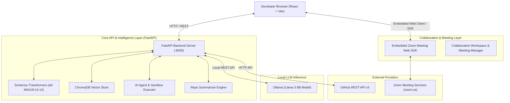

# RepoSense Intelligence Platform — Technical Documentation & Specification

## 1. Executive Summary

**RepoSense** is an end-to-end intelligent repository discovery, AI analysis, and real-time developer collaboration platform. Built to empower developers, researchers, and open-source contributors, RepoSense replaces traditional keyword matching with **AI-driven semantic search**, enables **zero-clone repository architectural summarization**, provides an **interactive AI code agent studio**, and integrates **embedded Zoom video meeting collaboration rooms** with **self-hosted Git repository pushing capabilities**.

---

## 2. Platform Architecture & Tech Stack

RepoSense operates on a decoupled full-stack architecture combining high-performance APIs, vector search databases, local LLM inference engines, and embedded web video meeting workspaces.



### Core Technologies
- **Frontend**: React 18, Vite, Tailwind CSS / Custom CSS Design Tokens, Lucide Icons.
- **Backend API**: Python 3.10+, FastAPI, Uvicorn, Pydantic, Requests.
- **AI & ML Stack**: Sentence-Transformers (`all-MiniLM-L6-v2`), ChromaDB, Ollama (`llama3:8b`).
- **Video Collaboration**: Zoom Meeting Web Client SDK Integration (`ZoomRoom.jsx`), Shareable Meeting Links, Dynamic Passcodes.
- **Deployment & Tunnels**: Cloudflare Tunnels (`cloudflared`), localtunnel, ngrok, PowerShell / Batch orchestration.

---

## 3. Feature Specifications

### 3.1. AI Semantic Repository Search & Discovery
- **Natural Language Query Engine**: Search repositories by human intent (e.g., *"lightweight python web framework with async websocket support"*).
- **Hybrid Semantic Reranking**: Combines live star-count metrics from GitHub with deep semantic similarity vectors calculated via `SentenceTransformer('all-MiniLM-L6-v2')`.
- **Category & Stack Filtering**: Pre-indexed and live search filters across popular tech verticals including Machine Learning, Web Development, Mobile, IoT, Systems, and Data Science.

### 3.2. Zero-Clone AI Repository Summarization
- **Remote Repo Inspection**: Downloads file structure trees, dependency manifests (`package.json`, `requirements.txt`, `Cargo.toml`, etc.), and README contents using the GitHub API without cloning the repository disk storage.
- **Local Llama 3 Architectural Analysis**: Synthesizes codebase structures and reverse-engineers system architecture, key features, installation steps, and target use cases.

### 3.3. AI Agent Studio & Execution Sandbox
- **Live Code Runner**: Executes Python and JavaScript code snippets in an isolated runner environment, returning execution duration, stdout/stderr output, and status codes.
- **AI Code Modifier & Refactorer**: Automatically refactors code, fixes syntax/logic errors, optimizes performance, and generates standard `diff` patch files.
- **Architecture Explainer**: Explains complex algorithms, variable dependencies, and system flow.
- **Repository Bug & Vulnerability Scanner**: Audits remote GitHub repositories for security vulnerabilities and generates suggested pull-request patches.

### 3.4. Embedded Zoom Video Collaboration Workspace
- **In-App Zoom Meetings**: Embedded Zoom Web Client viewport inside the application ([`ZoomRoom.jsx`](file:///d:/projects/major%20project/RepoSense-Intelligent-Repository-Discovery-and-Collaboration-Platform/frontend/src/pages/ZoomRoom.jsx)), supporting full video, audio, and screen sharing.
- **Instant Meeting Provisioning**: Automatically generates unique 10-digit Meeting IDs, Passcodes, and direct join/invite links.
- **Dual-Workspace Studio**: Interactive side-by-side view featuring the Zoom video call alongside the **AI Code Agent Studio** for concurrent pair programming and AI refactoring.
- **Collaborator Invitations**: Real-time team presence tracking and automated invite notifications for maintainers and contributors.

### 3.5. Self-Hosted Git VCS Host & Remote Push
- **HTTP Git Smart Protocol**: Allows push/clone operations using standard Git CLI (`git push origin main`).
- **Instant Repository Creation**: Server automatically provisions repositories upon receiving an initial `git push`.

---

## 4. API Endpoints Reference

### 4.1. Core & Search Endpoints
- `GET /`  
  **Description**: System health check and backend capability overview.  
  **Response**: `{"status": "online", "message": "...", "capabilities": [...]}`

- `GET /search?q={query}`  
  **Description**: Performs live GitHub search combined with AI semantic reranking.  
  **Response**: `{"query": "...", "count": 10, "results": [...], "source": "live_github"}`

- `GET /trending`  
  **Description**: Retrieves global trending repositories.

- `GET /categories/{category_name}`  
  **Description**: Retrieves repositories categorized under specific technology topics.

### 4.2. AI Summarization Endpoints
- `POST /summarize-github`  
  **Request Body**: `{"github_url": "https://github.com/owner/repo"}`  
  **Response**:  
  ```json
  {
    "status": "success",
    "summary": {
      "name": "repo-name",
      "description": "...",
      "architecture": "...",
      "key_features": [...]
    },
    "raw_analysis": {
      "file_tree": [...],
      "tech_stack": [...],
      "dependencies": [...]
    }
  }
  ```

### 4.3. AI Agent Studio Endpoints
- `POST /api/agent/run` — Executes code snippets (`code`, `language`).
- `POST /api/agent/modify` — Refactors/modifies code (`code`, `prompt`, `action`, `language`).
- `POST /api/agent/explain` — Explains code structure (`code`, `language`).
- `POST /api/agent/scan-repo` — Scans repository for bugs (`github_url`).

---

## 5. Zoom Meeting Workspace Specifications

| Parameter / Feature | Value / Mechanism | Description |
| :--- | :--- | :--- |
| **Meeting ID Format** | 10-digit numerical (`938 120 4932`) | Dynamic provisioned meeting room ID |
| **Passcode Security** | Dynamic alphanumeric (`repo742`) | Secured access passcode |
| **Web Client URL** | `https://zoom.us/wc/{meetingId}/join` | Embedded iframe browser viewport |
| **Dual Studio Mode** | Concurrent Zoom Call + AI Code Agent | Side-by-side live video and AI refactoring sandbox |
| **Collaborator Invites** | Live invitation dispatch | Notify online maintainers and contributors |

---

## 6. Directory & Codebase Structure

```text
RepoSense/
├── backend/
│   ├── src/
│   │   ├── main.py                   # FastAPI Application Entry point
│   │   ├── services/
│   │   │   ├── search_service.py     # Sentence-Transformers semantic reranking engine
│   │   │   ├── summarizer_service.py # Ollama / Llama 3 summarization service
│   │   │   ├── agent_service.py      # Code sandbox execution & refactoring agent
│   │   │   └── crawler_service.py    # GitHub repo crawler & indexer
│   │   └── integrations/
│   │       └── github.py             # GitHub REST API v3 parser & file tree builder
│   └── requirements.txt              # Backend dependencies
├── frontend/
│   ├── src/
│   │   ├── pages/
│   │   │   ├── Home.jsx              # Semantic Discovery & Reranking UI
│   │   │   ├── GitHubSummarizer.jsx  # AI Repo Architectural Breakdown UI
│   │   │   ├── AIAgentStudio.jsx     # Code Execution & Refactoring Studio
│   │   │   ├── CollaborationHub.jsx  # Collaboration Meeting Manager
│   │   │   └── ZoomRoom.jsx          # Zoom Video Meeting & Dual Studio Room
│   │   └── components/
│   │       └── AICodeAgent.jsx       # AI Agent Studio Tabbed Interface
│   └── package.json                  # Frontend dependencies
├── REMOTE_PUSH_GUIDE.md              # Remote Git Push Setup & Guide
├── start.bat                         # Windows Batch All-in-One Launcher
└── start_public_server.bat           # Public Tunnel Server Launcher
```

---

## 7. Quick Setup & Installation Guide

### Prerequisites
1. **Python 3.10+** & **Node.js 18+**
2. **Ollama**: Download from [ollama.com](https://ollama.com/) and pull Llama 3:
   ```bash
   ollama pull llama3:8b
   ```

### 1. Launching Services (Automatic)
Run the automated launcher batch script:
```cmd
start.bat
```
This starts:
- **Backend API**: `http://localhost:8000`
- **Frontend App**: `http://localhost:5173`

### 2. Manual Startup (Individual Modules)

#### Backend Setup
```bash
cd backend
pip install -r requirements.txt
python -m src.main
```

#### Frontend Setup
```bash
cd frontend
npm install
npm run dev
```

---

## 8. Git Remote Push Usage

To upload projects from any laptop to RepoSense:
1. Initialize local repository:
   ```bash
   git init
   git add .
   git commit -m "Initial commit"
   ```
2. Add RepoSense server remote and push:
   ```bash
   git remote add origin http://<SERVER-IP>:8000/git/developer/my-project.git
   git push -u origin main
   ```

---
*Documentation maintained for RepoSense Intelligent Repository Discovery & Collaboration Platform.*
