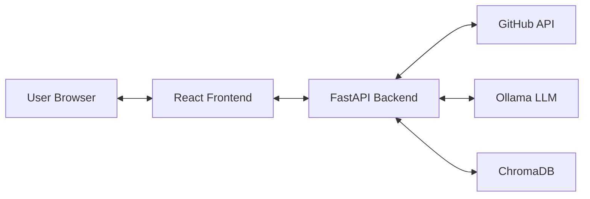

# RepoSense Intelligence Platform

RepoSense is an intelligent repository discovery and collaboration platform. It leverages AI and semantic search to help developers find and understand open-source projects by "meaning" rather than just keywords.

## Key Features

- **Semantic Discovery**: Search for repositories using natural language descriptions (e.g., "beginner friendly react project with firebase").
- **AI Summarization**: Generate deep, architectural summaries of any GitHub repository without cloning it, powered by **llama3**.
- **Discovery Feed**: Explore trending repositories categorized by modern tech stacks like ML, IoT, and Web Dev.
- **VCS Utility**: A built-in CLI tool for local repository management and platform integration.

## System Architecture

RepoSense is built with a decoupled Full-Stack architecture:

- **Frontend**: React (Vite) + Tailwind CSS
- **Backend**: FastAPI (Python)
- **Vector DB**: ChromaDB for semantic embeddings
- **AI Model**: llama3 (8b) running locally via Ollama
- **Embeddings**: Sentence-Transformers (`all-MiniLM-L6-v2`)



## Project Structure

```text
/
├── backend/
│   ├── src/            # Clean Architecture layers (api, services, integrations)
│   ├── storage/        # Persistent database storage
│   └── README.md       # Backend deep-dive
├── frontend/
│   ├── src/            # Modular React structure (pages, components, services)
│   └── README.md       # Frontend deep-dive
└── README.md           # System entry point (this file)
```

## How It Works: The pipeline

1. **Discovery**: The backend crawler periodically indexes top GitHub repositories into ChromaDB using AI-generated embeddings.
2. **Search**: When you search, your query is embedded and compared against the vector database to find the best semantic matches.
3. **Summarization**: For any specific repo, our engine fetches its codebase structure and README, then uses **llama3** to reverse-engineer its architecture and purpose.

## Quick Start

### 1. Backend Setup
1. Install [Ollama](https://ollama.com/) and pull the model: `ollama pull llama3:8b`
2. From the `/backend` folder:
   ```bash
   pip install -r requirements.txt
   python -m src.main
   ```

### 2. Frontend Setup
1. From the `/frontend` folder:
   ```bash
   npm install
   npm run dev
   ```

## Detailed Documentation
- [Backend Architecture & Logic](./backend/README.md)
- [Frontend Components & Flow](./frontend/README.md)

---
*Built for the future of repository discovery.*
