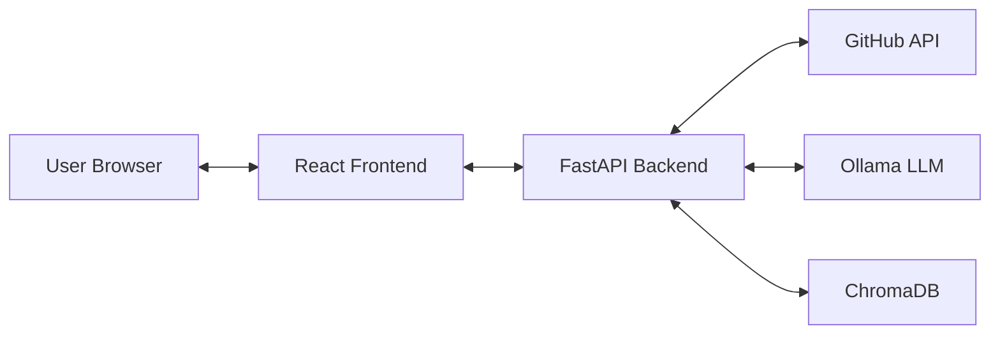

# RepoSense Intelligence Platform

RepoSense is an intelligent repository discovery and collaboration platform that leverages AI and semantic search to help developers find, understand, and explore open-source projects by meaning rather than keywords.

---

## Badges

<!-- Add CI / license / release badges here as you enable services -->


## Table of Contents

- [Key Features](#key-features)
- [Architecture](#architecture)
- [Language Composition](#language-composition)
- [Quick Start](#quick-start)
  - [Backend](#backend)
  - [Frontend](#frontend)
- [How It Works](#how-it-works)
- [Project Structure](#project-structure)
- [Development Notes](#development-notes)
- [Contributing](#contributing)
- [Contact](#contact)


## Key Features

- **Semantic Discovery** — Search for repositories using natural language (e.g., "beginner friendly react project with firebase").
- **AI Summarization** — Generate architectural and purpose-driven summaries of any GitHub repository without cloning it, powered via an on-host LLM (llama3) through Ollama.
- **Discovery Feed** — Explore trending repositories categorized by modern tech stacks (ML, IoT, Web, etc.).
- **VCS Utility** — A small CLI for local repository management and publishing to the discovery engine.


## Architecture

RepoSense follows a decoupled full-stack architecture:

- Frontend: React (Vite) + Tailwind CSS
- Backend: FastAPI (Python)
- Vector DB: ChromaDB for semantic embeddings
- LLM: llama3 (8b) served via Ollama
- Embeddings: Sentence-Transformers (`all-MiniLM-L6-v2`)


```mermaid
graph LR
    User[User Browser] <--> Frontend[React Frontend]
    Frontend <--> Backend[FastAPI Backend]
    Backend <--> GitHub[GitHub API]
    Backend <--> Ollama[Ollama LLM]
    Backend <--> VectorDB[ChromaDB]
```


## Language Composition

This repository is primarily written in:

- JavaScript: 54.8%
- Python: 40.5%
- CSS: 4.3%
- HTML: 0.4%

(These percentages reflect the main implementation areas: frontend in JS, backend in Python.)


## Quick Start

> Minimum tested versions: Python 3.9+, Node 16+

### Backend

1. Install Ollama and pull the model (local LLM):

```bash
# Install Ollama: https://ollama.com/docs
ollama pull llama3:8b
```

2. From the `backend/` folder:

```bash
cd backend
pip install -r requirements.txt
python -m src.main
```

The API will be available at `http://localhost:8000` by default.

Notes:
- Ensure `ollama serve` is running if you are invoking the LLM through the backend.
- The backend uses ChromaDB for the vector store — storage files are under `backend/storage/repo_db/` by default.


### Frontend

1. From the `frontend/` folder:

```bash
cd frontend
npm install
npm run dev
```

The frontend runs at `http://localhost:5173` by default.


## How It Works: Pipeline

1. Discovery: a crawler indexes trending GitHub repositories and stores embeddings in ChromaDB.
2. Search: incoming queries are embedded and compared with the vector DB to return semantic matches.
3. Summarization: the backend fetches a repository's metadata and README (no clone required), builds a structured prompt, and uses the LLM to produce a JSON summary (purpose, tech stack, architecture, notable files).


## Project Structure

```
/
├── backend/
│   ├── src/            # Clean Architecture layers (api, services, integrations)
│   ├── storage/        # Persistent vector DB storage
│   └── README.md       # Backend deep-dive
├── frontend/
│   ├── src/            # React app (pages, components, services)
│   └── README.md       # Frontend deep-dive
└── README.md           # System entry point (this file)
```


## Development Notes

- Backend services of interest:
  - `search_service.py`: hybrid semantic search using ChromaDB + sentence-transformer embeddings.
  - `summarizer_service.py`: orchestration for LLM prompts and JSON generation.
  - `crawler_service.py`: seeds the vector DB with trending repos.
- Integrations:
  - `github.py`: fetches repository metadata and file lists via the GitHub API (no cloning required).
- Frontend:
  - `src/services/api.js` centralizes network calls to the backend.


## Contributing

Contributions and improvements are welcome. A basic workflow:

1. Fork the repository
2. Create a branch for your feature/fix
3. Open a pull request with a clear description and related issue (if any)

Please follow repository coding conventions and add tests where appropriate.


## Contact

Maintainer: @ssarveshr


---

Built for the future of repository discovery.
