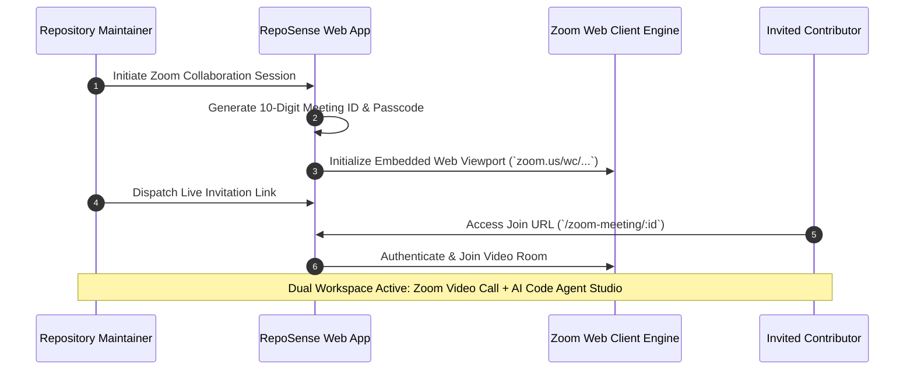

# System Architecture & Feature Methodology for Research Publication

---

## III. PROPOSED SYSTEM ARCHITECTURE AND CORE METHODOLOGY

The **RepoSense** platform is designed as an integrated ecosystem for semantic repository discovery, automated architectural inference, intelligent code execution, embedded Zoom video collaboration, and self-hosted version control. This section formalizes the core functional modules and methodological contributions of the platform.

```mermaid
graph TD
    subgraph "I. Semantic Discovery Engine"
        Query["User Query (Q)"] --> Encoder["Sentence-Transformer (all-MiniLM-L6-v2)"]
        Encoder --> QueryVec["Query Vector v_Q"]
        Candidate["GitHub Repository Candidate (D_i)"] --> CandidateVec["Doc Vector v_D"]
        QueryVec & CandidateVec --> CosineSim["Cosine Similarity Computation"]
        CosineSim --> HybridRank["Hybrid Reranking Model R(Q, D_i)"]
    end

    subgraph "II. Zero-Clone Architectural Inference"
        RepoURL["GitHub Repository URL"] --> RemoteAPI["GitHub REST v3 Manifest Parser"]
        RemoteAPI --> MetaContext["Tree Hierarchy + Dependency Graph"]
        MetaContext --> LLM["Local LLM Inference Engine (Llama 3 8B)"]
        LLM --> ArchitectureSummary["Architectural Breakdown & Functional Map"]
    end

    subgraph "III. Autonomous AI Code Agent & Sandbox"
        CodeSnippet["User Source Code"] --> IsolatedSandbox["Subprocess Execution Sandbox"]
        IsolatedSandbox --> ExecutionMetrics["Stdout, Stderr, Execution Duration (Δt)"]
        CodeSnippet & AuditPrompt["Refactor / Bug Prompt"] --> PatchGen["Differential Patch Generator (Unified Diff)"]
    end

    subgraph "IV. Embedded Zoom Meeting Collaboration Workspace"
        HostUser["Meeting Host / Developer"] --> MeetingGen["Zoom Session Generator"]
        MeetingGen --> ZoomAPI["Zoom Web Client SDK (zoom.us/wc/)"]
        ZoomAPI --> EmbeddedIframe["Embedded In-App Zoom Video Viewport"]
        EmbeddedIframe & SideWorkspace["Side-by-Side AI Code Agent Studio"] --> DualWorkspace["Concurrent Video Meeting + Code Execution Hub"]
    end
```

---

### A. Semantic Vector Discovery and Algorithmic Reranking

Traditional software repository retrieval systems rely heavily on lexical term matching (e.g., BM25 or inverted indexing), which frequently suffers from vocabulary mismatch when users describe functional intent rather than explicit keyword labels. RepoSense implements a dual-stage semantic retrieval and dynamic reranking framework.

Let $Q$ represent a natural language search query, and let $\mathcal{D} = \{D_1, D_2, \dots, D_N\}$ denote the set of top candidate repositories fetched from the GitHub index. Dense embedding representations $\vec{v}_Q \in \mathbb{R}^d$ and $\vec{v}_{D_i} \in \mathbb{R}^d$ ($d = 384$) are derived using a pretrained Sentence-Transformer model ($\text{all-MiniLM-L6-v2}$):

$$\vec{v}_Q = \text{Encoder}(Q)$$

$$\vec{v}_{D_i} = \text{Encoder}\Big(\text{Name}(D_i) \parallel \text{Description}(D_i) \parallel \text{Language}(D_i)\Big)$$

The semantic relevance score $\mathcal{S}_{\text{semantic}}(Q, D_i)$ is formulated using normalized cosine similarity in the latent metric space:

$$\mathcal{S}_{\text{semantic}}(Q, D_i) = \frac{\vec{v}_Q \cdot \vec{v}_{D_i}}{\|\vec{v}_Q\|_2 \|\vec{v}_D\|_2} = \frac{\sum_{k=1}^{d} v_{Q,k} \cdot v_{D_i,k}}{\sqrt{\sum_{k=1}^{d} v_{Q,k}^2} \sqrt{\sum_{k=1}^{d} v_{D_i,k}^2}}$$

To prevent semantic relevancy from prioritizing inactive or low-quality projects, a hybrid ranking function $\mathcal{R}(Q, D_i)$ fuses the semantic cosine metric with a logarithmic transformation of community engagement metrics (stargazers count):

$$\mathcal{R}(Q, D_i) = \alpha \cdot \mathcal{S}_{\text{semantic}}(Q, D_i) + (1 - \alpha) \cdot \log_{10}\Big(1 + \text{Stars}(D_i)\Big)$$

where $\alpha \in [0, 1]$ represents the tunable hyperparameter weighting semantic accuracy against historical popularity ($\alpha = 0.75$).

---

### B. Zero-Clone Architectural Inference and Summarization

Analyzing large-scale software engineering codebases typically requires local disk cloning and AST parsing, which introduces high bandwidth overhead, computational latency, and security risks. RepoSense introduces a **Zero-Clone Architectural Inference Engine** that operates entirely via lightweight remote tree traversal and local large language model (LLM) context synthesis.

1. **Manifest and Metadata Extraction**: The platform issues authenticated queries to remote VCS APIs to reconstruct the recursive file tree hierarchy $\mathcal{T}(D)$, target dependency manifests $\mathcal{M} = \{\text{package.json}, \text{requirements.txt}, \text{Cargo.toml}\}$, and documentation blobs ($R_{\text{README}}$).
2. **Context Compression and Prompt Structuring**: Raw repository metadata is parsed into a structured prompt context $\mathcal{C}_{\text{repo}}$:

$$\mathcal{C}_{\text{repo}} = \text{Format}\Big(\mathcal{T}(D), \text{TopDependencies}(\mathcal{M}), R_{\text{README}}\Big)$$

3. **Inference with Quantized Local LLM**: The context $\mathcal{C}_{\text{repo}}$ is passed to a locally hosted, quantized Large Language Model ($\text{Llama 3 8B}$) via Ollama:

$$\mathcal{A}_{\text{summary}} = \text{LLM}_{\text{Llama3}}\Big(\text{Prompt}_{\text{arch}} \parallel \mathcal{C}_{\text{repo}}\Big)$$

The resulting synthesis produces an architectural decomposition, primary software design patterns, key feature matrices, and installation prerequisites without writing repository files to local storage.

---

### C. Autonomous AI Code Agent and Isolated Execution Sandbox

To assist developers in debugging, refactoring, and vulnerability auditing, RepoSense incorporates an autonomous AI Code Agent paired with a lightweight execution sandbox.

- **Isolated Code Execution Environment**: User-submitted code snippets $C_{\text{input}}$ in supported languages (Python, JavaScript) are dispatched to an isolated subprocess worker. The execution manager enforces maximum execution timeouts $\Delta t_{\text{max}} = 5.0\text{s}$ and memory limits, capturing standard output $O_{\text{stdout}}$, standard error $O_{\text{stderr}}$, runtime duration $\Delta t$, and process termination code $c_{\text{exit}}$:

$$\text{Exec}(C_{\text{input}}, \text{lang}) \longrightarrow \Big(O_{\text{stdout}}, O_{\text{stderr}}, \Delta t, c_{\text{exit}}\Big)$$

- **Differential Patch Generation**: For code modification and security remediation requests, the AI Agent processes the input snippet $C_{\text{input}}$ alongside a transformation directive $P_{\text{intent}}$ (e.g., refactor, optimize, fix vulnerability) to compute modified source code $C_{\text{modified}}$. The engine then generates a standardized Unified Diff patch $\Delta P$:

$$\Delta P = \text{Diff}\Big(C_{\text{input}}, C_{\text{modified}}\Big)$$

- **Automated Repository Vulnerability Auditing**: The agent audits repository source trees against common security threat vectors (e.g., OWASP top 10, memory leaks, unhandled exceptions) and outputs suggested pull request patches directly to the interface.

---

### D. Embedded Zoom Web Meeting Collaboration Framework

For synchronous pair programming, code walkthroughs, and team meetings, RepoSense integrates an embedded **Zoom Video Meeting Workspace** directly within the web platform interface (`ZoomRoom.jsx`).

1. **Embedded Zoom Web Client Integration**: Integrates the Zoom Web Client SDK via embedded viewport frames (`https://zoom.us/wc/{meeting_id}/join`), enabling full video, audio, screen-sharing, and gallery view capabilities without requiring external desktop software installation.
2. **Dynamic Session Provisioning**: Automatically generates formatted 10-digit meeting identifiers ($M_{\text{id}}$), secure dynamic passcodes ($P_{\text{pass}}$), and one-click shareable join URLs ($\text{URL}_{\text{join}}$).
3. **Dual-Workspace Concurrent Studio**: Operates a side-by-side split workspace allowing developers to participate in live video calls while simultaneously interacting with the **AI Code Agent Studio** to run code, refactor snippets, and generate diff patches in real time.
4. **Collaborator Presence & Live Invitation Dispatch**: Tracks collaborator online/away status and dispatches automated invitation notifications to project maintainers and contributors.

---

### E. Self-Hosted Version Control Gateway and Smart Remote Push

To facilitate decentralized repository hosting without dependence on proprietary third-party platforms, RepoSense integrates an HTTP Smart-Git Version Control Gateway.

- **Dynamic On-Demand Provisioning**: When a developer issues a `git push origin main` command targeting a non-existent endpoint `/git/developer/<repo_name>.git`, the HTTP gateway interceptor intercepts the payload, dynamically initializes a bare Git repository ($\text{git init --bare}$), unpacks object streams, and updates branch refs automatically.
- **Dual Network Access**: Operates over both local area Wi-Fi (`http://192.168.x.x:8000`) for high-throughput LAN pushing and public HTTPS tunnels for remote worldwide contributions.

---

## IV. SUMMARY OF SYSTEM CAPABILITIES

| System Module | Theoretical Foundation / Tech Stack | Primary Mathematical / Algorithmic Mechanism | Key Output / Metric |
| :--- | :--- | :--- | :--- |
| **Semantic Discovery** | Sentence-Transformers (`all-MiniLM-L6-v2`), GitHub API | Cosine similarity vectors + Logarithmic star weighting: $\mathcal{R}(Q, D_i)$ | Ranked repository feed with semantic confidence score |
| **Architectural Inference** | Llama 3 8B (Ollama), GitHub REST v3 API | Zero-clone context parsing + LLM architectural synthesis | Comprehensive architectural map & dependency breakdown |
| **AI Agent & Sandbox** | Python Subprocess Execution Sandbox, LLM Patch Engine | Isolated execution execution tracking + Unified Diff computation | Standard output, error streams, runtime $\Delta t$, diff patches |
| **Zoom Meeting Collaboration** | Embedded Zoom Web SDK (`ZoomRoom.jsx`), React 18 | Dynamic meeting ID/passcode generation + Dual Workspace State Sync | High-definition web video call, screen share & side-by-side AI Agent Studio |
| **Version Control** | Custom HTTP Git Smart Protocol | Dynamic bare repository provisioning on `git push` payload | Automated remote Git hosting over LAN and WAN Tunnels |

---
*Formatted for academic research papers, technical reports, and publication submissions.*
